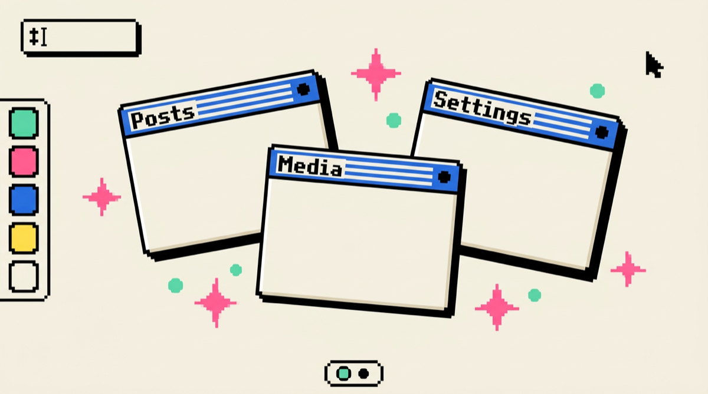
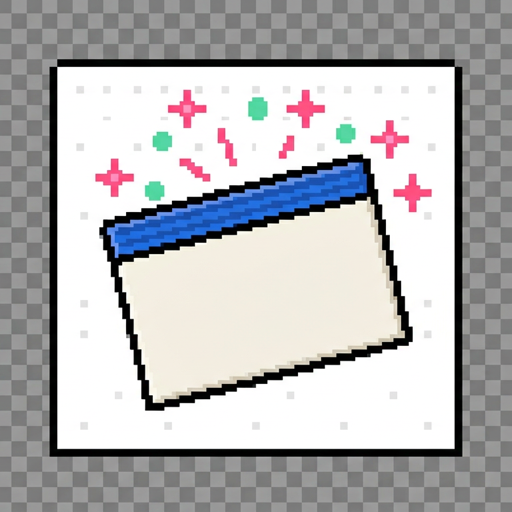
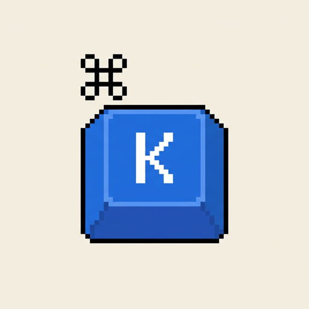
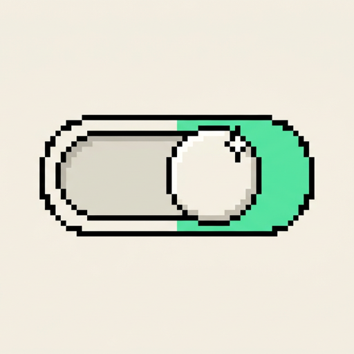
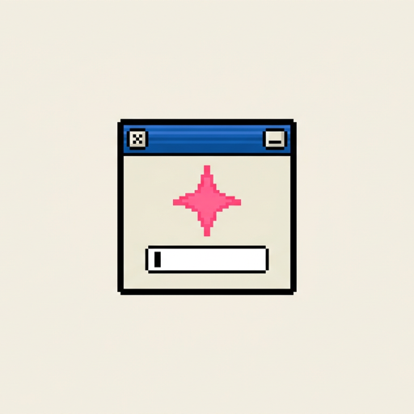
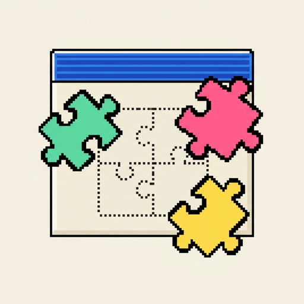
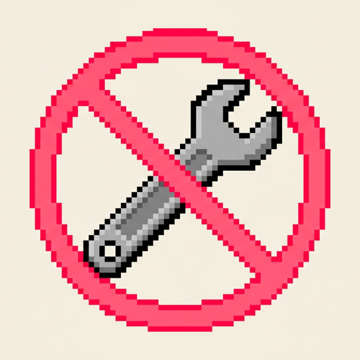

# WP Desktop Mode

> Your wp-admin, reimagined as a desktop OS. Draggable windows, a dock, virtual desktops, a command palette — all opt-in, zero Core patches.

<video src="https://github.com/user-attachments/assets/590aacc2-e9d7-4213-889e-b91e060e1bd8" controls width="720"></video>

## Why it's cool

 **Admin, but fun.** Drag windows around. Snap them into grids. Spin up a second desktop for your media tasks and a third for orders. Your wp-admin finally behaves like the rest of your computer.

 **Muscle memory from your OS.** Cmd+K palette, a dock, a taskbar, minimize/maximize/fullscreen — it's the gestures you already know, pointed at WordPress.

 **Opt-in per user.** Flip the switch in the admin bar. Everyone else keeps classic wp-admin exactly as it was. Deactivate the plugin and nothing is left behind.

 **AI lives in the shell.** Cmd+K opens a slash-command assistant that searches posts, pages and comments, and auto-analyzes content on save.

 **Built to be extended.** Icons, dock items, widgets, wallpapers (yes, physics-enabled ones), slash commands, native framework windows — every surface is a public WordPress hook.

 **Zero Core patches.** It's "just a plugin". No forks, no core edits, no weird build dance.

## Try it in 30 seconds

1. Download [`wp-desktop-mode.zip`](https://github.com/WordPress/desktop-mode/releases/latest/download/wp-desktop-mode.zip) from the latest release.
2. In wp-admin: **Plugins → Add New → Upload Plugin**, pick the zip, activate.
3. Click the **desktop icon** in the admin bar (top-right). Click it again any time to return to classic admin.

Works on [Studio](https://developer.wordpress.com/studio/), [wp-env](https://developer.wordpress.org/block-editor/reference-guides/packages/packages-env/), or any hosted WordPress. No Node, no build step.

**Requirements:** WordPress 6.0+, PHP 7.4+.

## For plugin authors

Every meaningful behavior in the shell is a hook. Drop an icon on the desktop, add a dock item, gate desktop mode by role, register a native framework window, ship your own slash command — all from your own plugin with zero patches here.

Start with **[docs/getting-started.md](docs/getting-started.md)** — a five-minute tour. The full API contract lives in [docs/](docs/README.md).

## Learn more

- **[Features](https://github.com/WordPress/desktop-mode/wiki/Features)** — the full list of what's already shipping.
- **[Roadmap](https://github.com/WordPress/desktop-mode/wiki/Roadmap)** — mobile, tablet, cross-window drag and drop.
- **[Development Setup](https://github.com/WordPress/desktop-mode/wiki/Development-Setup)** — hack on the plugin itself.
- **[Repository Layout](https://github.com/WordPress/desktop-mode/wiki/Repository-Layout)** — where things live.

## License

[GPLv2 or later](LICENSE).
