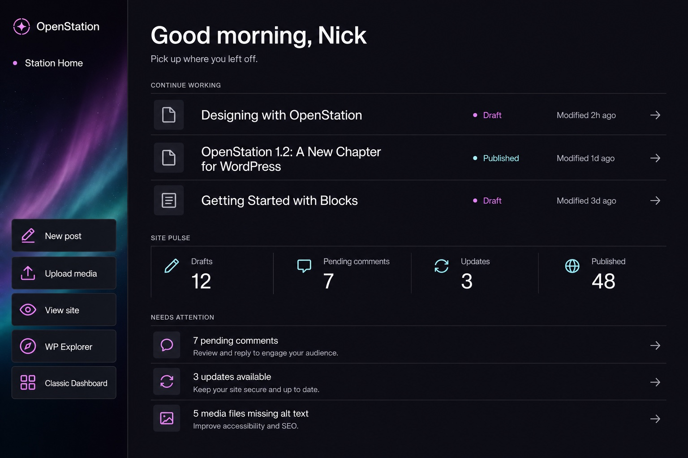

# Station Home

Station Home is OpenStation's native replacement for the ordinary WordPress Dashboard inside the desktop shell. It is a personal launch surface, not an analytics dashboard: recent work, a compact site pulse, a short attention queue, and role-aware actions are visible in one window.

Station Home is a **per-user opt-in** (`stationHomeEnabled`, default off), toggled from **OS Settings → Features → Beta features → "Use Station Home as your Dashboard"**. Until a user opts in, `index.php` opens as the ordinary chromeless Dashboard iframe — including any custom dashboard a plugin has built there.



The image is the approved design north star. Live DOM owns all text, values, state, hit targets, focus behavior, and responsive layout.

## The app

Station Home is an [App Framework](./app-framework.md) app — `apps/station-home/` — and the first one painted entirely on the server: an `.os.php` that declares the window, a `parts/snapshot.php` that reads the role-aware data, and a `parts/view.php` that renders the body as a function of that snapshot and the one state key the window keeps (`customizing`, whether the Customize picker is open). There is no client script. Every interaction — Refresh, Customize, a picker switch, a shell-bound quick action — is one dispatch to `POST desktop-mode/v1/apps/desktop-mode-dashboard/dispatch`, and the re-rendered body is morphed into the live window so nodes, scroll position and focus survive.

| Interaction | What it is |
|---|---|
| Refresh | The built-in `refresh` action — a re-render, nothing to declare |
| Customize / dismiss the picker | `customize` / `customize_close` — the `customizing` state key |
| A picker switch | `toggle_card` (`id`, `checked`) → `openstation_station_home_set_card_preference()`; the same paint that settles the switch adds or removes the card |
| New post, Upload media, View site, a recent row, an attention row | Plain links — the shell's link interceptor opens admin URLs in windows and lets `target="_blank"` through |
| WP Explorer, Classic Dashboard | `launch` (`id`) → the `open` / `open_url` effects. Neither has a URL the interceptor may follow: a native window has none, and the classic escape is the one admin URL the interceptor deliberately refuses to steal back into the shell |
| A window restored from minimized | The `show` lifecycle action — a repaint |
| Content changed anywhere on the desktop | `watch( '*' )` — a coalesced repaint |

## Behavior

- When the current user has opted in, ordinary `wp-admin/index.php` destinations remap to the native window `desktop-mode-dashboard`. Existing Dashboard menu entries, portal fallbacks, bookmarks, and default-window behavior therefore keep their current URL contract. With the opt-in off, the same URLs open the classic Dashboard as a chromeless iframe, and a saved session never restores the Station Home window.
- **Classic Dashboard** opens `index.php?desktop_mode_classic=1` in a separate chromeless iframe window. The native URL matcher explicitly ignores that query flag, so the escape cannot loop back into Station Home.
- The stylesheet loads on the window's first open, as every app's does. Nothing of Station Home is on the boot path but the URL matcher.
- The greeting follows the site's clock (`wp_date`), the hour WordPress itself reasons in for scheduling and timestamps.
- Actions are capability-aware: post creation, media upload, WP Explorer, comment moderation, updates, and missing-alt reminders only appear when the current user can act on them. `launch` resolves against the same gated list, so a button a user was never shown launches nothing.
- Recent work is limited to five of the current user's most recently modified editable posts, pages, and public UI-visible custom post types. Core's internal editor records such as navigation, templates, and styles stay out of the list.
- The body reads cached WordPress update data. Opening Station Home does not initiate an update check.
- Third-party plugins can register structured cards with `openstation_register_station_home_card()`. Every card declares whether it starts on or off; each user can then opt in or out from **From your plugins → Customize**. Disabled cards do not execute their data callbacks.
- Explicit card choices live in the current user's `openstation_station_home_card_preferences` meta map. `openstation_station_home_set_card_preference( $user_id, $id, $enabled )` is the one write path — it refuses ids not registered for the current user and fires `openstation_station_home_card_preference_updated`.
- A failed dispatch leaves the last body in place and says so in a toast; there is no separate error state to design for.

## Plugin cards

Station Home owns the layout and accepts structured data rather than plugin HTML. That keeps the dashboard responsive, accessible, safely escaped, and visually coherent even when several plugins contribute at once.

Register cards on `init` after OpenStation has loaded:

```php
add_action( 'init', function () {
    if ( ! function_exists( 'openstation_register_station_home_card' ) ) {
        return;
    }

    openstation_register_station_home_card( 'my-plugin-orders', array(
        'label'           => __( 'Orders', 'my-plugin' ),
        'description'     => __( 'Orders waiting to be fulfilled.', 'my-plugin' ),
        'provider'        => __( 'My Plugin', 'my-plugin' ),
        'icon'            => 'dashicons-cart',
        'default_enabled' => false,
        'capabilities'    => array( 'manage_options' ),
        'callback'        => function () {
            return array(
                'value'        => '4',
                'detail'       => __( 'Ready to fulfil', 'my-plugin' ),
                'url'          => admin_url( 'admin.php?page=my-plugin-orders' ),
                'action_label' => __( 'Open orders', 'my-plugin' ),
                'tone'         => 'warning',
            );
        },
    ) );
} );
```

The callback receives `( int $user_id, array $entry )` and runs only when its card is enabled. It returns optional plain-text `value`, `detail`, `action_label`, a safe `url`, `external` for new-tab links, and `tone` (`neutral`, `info`, `success`, `warning`, or `danger`). Returning `WP_Error`, a non-array, or throwing omits the card from that render without breaking Station Home.

The registry is filterable through `openstation_station_home_cards`; enabled callback results pass through `openstation_station_home_card_data`. See the complete recipe in [`examples/station-home-card.md`](./examples/station-home-card.md).

## Design contract

The approved direction is **Editorial Flight Deck**:

- Void identity rail with a single restrained Holomesh moment.
- The current OpenStation mark, shared with the PWA/app icon set.
- Oversized personal greeting and one-line orientation copy.
- Wide, border-separated editorial rows instead of card grids.
- Four numeric site instruments, not invented trend charts.
- A short actionable queue that becomes an explicit “All clear” state when empty.
- Geist for interface copy and Geist Mono for labels and instruments.
- All actions remain at least 44 CSS pixels, use icon plus accessible label, and expose visible keyboard focus.

At a window width of 820px or less, the identity rail becomes a compact top action band. At 620px or less, metrics become a two-column strip and secondary recent-work metadata yields before titles or actions. The structure responds to the window body through container queries, not the browser viewport.

## Imagegen record

Mode: built-in Imagegen. The selected concept was generated at 1536×1024 with this final prompt:

> Use case: ui-mockup
>
> Asset type: shippable-fidelity desktop application dashboard concept, 1536×1024 landscape
>
> Primary request: Design “Station Home,” a native OpenStation dashboard window for WordPress. Direction B: Editorial Flight Deck. This is a practical product UI, not concept art.
>
> Scene/backdrop: one large OpenStation application window, cropped primarily to its content, on a subtle dark desktop.
>
> Style/medium: realistic polished software UI mockup; Geist for interface text and Geist Mono for small instrument labels and numbers; disciplined editorial grid.
>
> Composition/framing: 3:2 landscape. A narrow vertical identity rail on the left contains “Station Home,” the site name, a restrained vertical aurora mesh, and five large quick actions. The remaining wide area is a quiet editorial canvas: an oversized “Good morning, Nick” heading and one-line summary at top; “Continue working” appears as three wide stacked editorial rows with large titles and small metadata; a horizontal “Site pulse” strip of four metrics sits beneath; a compact “Needs attention” list closes the page. The page should feel like a purposeful personal workstation, not analytics software.
>
> Color palette: OpenStation brand — Void #0c0b0f, Obsidian #1a1721, Pulse #f252fc used sparingly, Nebula #ec9bff, Sirius #c2f1f1, Starlight #fffbff, Shade greys. Dark accessible UI.
>
> Materials/textures: flat editorial surfaces, generous spacing, hairline separators, one aurora mesh only in the identity rail. No card shadows. No glassmorphism.
>
> Text (verbatim where visible): “Station Home”, “OpenStation”, “Good morning, Nick”, “Pick up where you left off.”, “Continue working”, “Site pulse”, “Needs attention”, “New post”, “Upload media”, “View site”, “WP Explorer”, “Classic Dashboard”, “Drafts”, “Pending comments”, “Updates”, “Published”.
>
> Content details: recent rows include post/page icon, content title, draft or published status, and relative modified time. Site pulse is four simple numeric instruments, not charts. Needs attention is a short list with clear arrow affordances. Controls are at least 44px and include icon plus label.
>
> Constraints: practical DOM/CSS-translatable layout; no sidebar navigation tree; no fake browser address bar; no multiple windows; no charts with invented trends; no tiny text; no photos or people; no stock graphics; no excessive glow; no watermark; generated mockup settles hierarchy and proportion only—live DOM will own all text, numbers, icons, controls, state, hit targets and focus.

The taste pass accepted the direction with one correction: the wide identity rail must become a compact top band in narrow windows. That correction is part of the live layout above.
