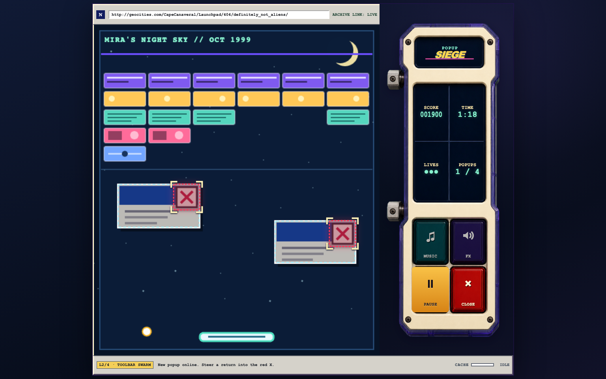

# Desktop Mode — Popup Siege

Popup Siege is a standalone companion plugin for
[Desktop Mode](https://github.com/WordPress/desktop-mode). It adds a
90-second Breakout-style rescue game to the Games hub, including the unified
leaderboard, play-time tracking, and score-to-beat challenges supplied by
Desktop Mode.



## Play

Mira Santos' fictional 1999 astronomy homepage is waiting for its archive
snapshot while adware takes over. Move the paddle, steer the ball into four
popup X targets, and clear all 30 corruption bricks before the connection or
your three lives run out.

Closing a popup awards points, purges nearby bricks, and starts a temporary
multiball. A completed rescue adds a bonus for time and lives remaining.
Challenge launches show the score to beat and allow one submitted run.

## Install

1. Install and activate Desktop Mode.
2. Install and activate the `desktop-mode-popup-siege.zip` companion plugin.
3. In **OS Settings → Features → Extended options**, turn on **Games**.
4. Open the **Games** desktop icon and choose **Popup Siege**.

Games are opt-in in Desktop Mode. While Games is off, this plugin stays
dormant and does not register or load the runtime.

## Integration

The PHP manifest gives Desktop Mode the launcher and scoreboard metadata. The
browser adapter and deterministic 0.7.0 runtime are registered but not
enqueued; Desktop Mode loads them only when a player launches Popup Siege.
PixiJS comes from Desktop Mode's shared module loader and is not bundled here.

Every launch owns a fresh mount, event subscriptions, resize observer, audio
owner, and animation controller. The adapter releases all of them when the
native window closes. It pauses the simulation while the window is blurred or
minimized and submits one frozen result payload after the terminal state.

The score filter accepts only Popup Siege's exact 20-key rules-v3 terminal
schema. It recomputes popup points, objective states, restoration percentage,
clear bonus, and the final score, then checks the rescue, timeout, or
out-of-lives terminal invariants. This is a friendly arcade plausibility guard,
not server-authoritative replay verification.

## Development

The release runtime is deterministically assembled from the pinned SDK and
versioned gameplay layers:

```sh
npm run build
npm run check
npm test
```

`npm run check` rebuilds the runtime, verifies the released adapter, runtime,
stylesheet, and generated-art hashes, and syntax-checks the browser
JavaScript. `npm test` runs the deterministic game/audio suites plus the
framework-free PHP registration and score-contract smoke test.

From the Desktop Mode repository root, build the installable extension zip
with:

```sh
./bin/package-extensions.sh
```

## Release evidence

This package preserves the Popup Siege 0.7.0 runtime, adapter, presentation
layers, deterministic tests, native-size screenshot approval, and generated
side-console provenance from the OpenStation release at source commit
`8eb8ee3`.

The evidence register under
`games/popup-breaker/docs/evidence/` describes its original source inventory.
Packaging the game as this companion plugin changes the WordPress wrapper, so
that original cohort hash is retained as provenance rather than presented as
proof of the new wrapper. The wrapper has its own registration, score
validation, packaging, and Plugin Check gates.

The approved screenshot proves one playing state at one native size. It does
not prove interaction, responsive layouts, alternate states, animation,
audible mix quality, or fun. Fresh unfamiliar-player fun testing and a human
audio-listening pass remain explicitly pending.
